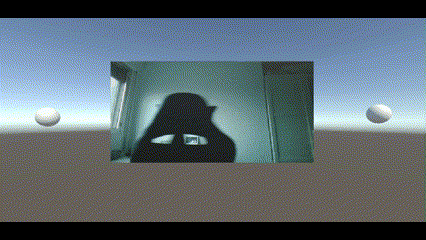

# II-Micrófono-Cámara

## Descripción

En esta práctica se han desarrollado dos escenas en Unity, una para la utilización de clips de audio y otra para la cámara y el micrófono. El paquete utilizado para estas funcionalidades es ```UnityEngine```.

En la primera escena se dispone de una araña que el usuario controla. Si la araña mata a alguna de las otras arañas, esta emite un sonido. En la escena también hay huevos, los cuales la araña se puede comer, emitiendo un sonido distinto.


En la segunda escena se dispone de un plano el cual actúa como pantalla, donde se puede ver lo que se captura desde la cámara del usuario. También se dispone de dos altavoces, por los cuales se reproduce el sonido captado por el micrófono del usuario.



---

## Scripts

### SpiderMovement.cs

En este script se define el movimiento que tendrá la araña para el ejercicio 1, utilizando los ejes y rotando como corresponde.

### Notificator.cs

Este script implementa el delegado que notificará los eventos que ocurren en la escena del ejercicio 1.

### SpiderBehaviour.cs

Este script contiene el comportamiento que sigue la araña en respuesta a los eventos definidos, utilizando los elementos de audio.

### Recorder.cs

Este script implementa el comportamiento del micrófono solicitado en el ejercicio 2, con una duración de grabación predeterminada de 20 segundos. Se utiliza la tecla 'R' para el comienzo y el final de la grabación. Una vez grabado el audio, se emiten por los altavoces de la escena.

### TV.cs

Este script implementa el comportamiento de la cámara solicitado en el ejercicio 3, 4 y 5. Se utiliza la tecla 'S' para el comienzo de la grabación, la tecla 'P' para pausar la grabación, la tecla 'D' para detener la grabación y la tecla 'X' para capturar el fotograma actual.

---

## Autor

Álvaro Fontenla León